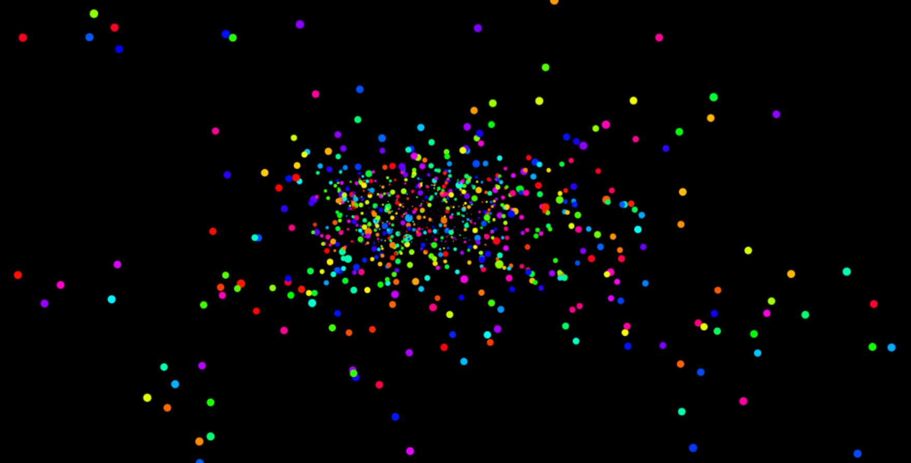

# cognitive-activism

𝘏𝘰𝘭𝘰𝘱𝘩𝘰𝘳𝘪𝘤 𝘊𝘰𝘨𝘯𝘪𝘴𝘤𝘪𝘶𝘮

Notes on Darin Stevenson: Cognitive Activism

A compilation of video lectures presented by Darin Stevenson concerning human cognition and psychology, culture and collectivity -- A revolutionary thinker at the forefront of cognitive activism who offers keys to psycho-cognitive reformation, liberation and empowerment.

https://www.youtube.com/playlist?list=PLUhmkuu0rcYkr4VewfxnaORnMHa8Wf7xn
